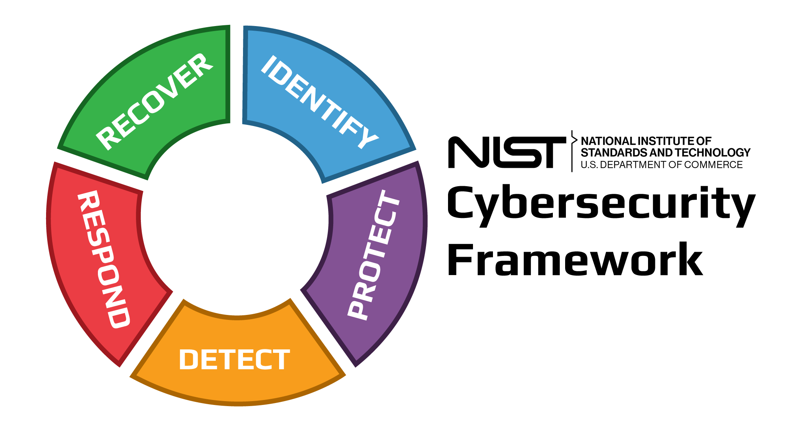
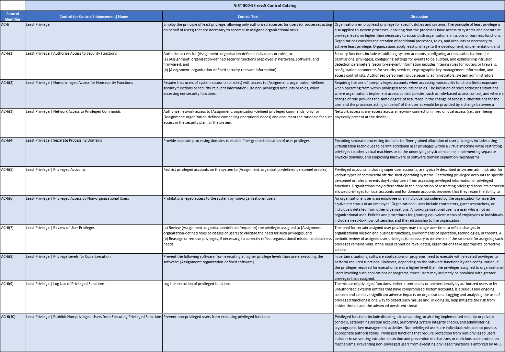
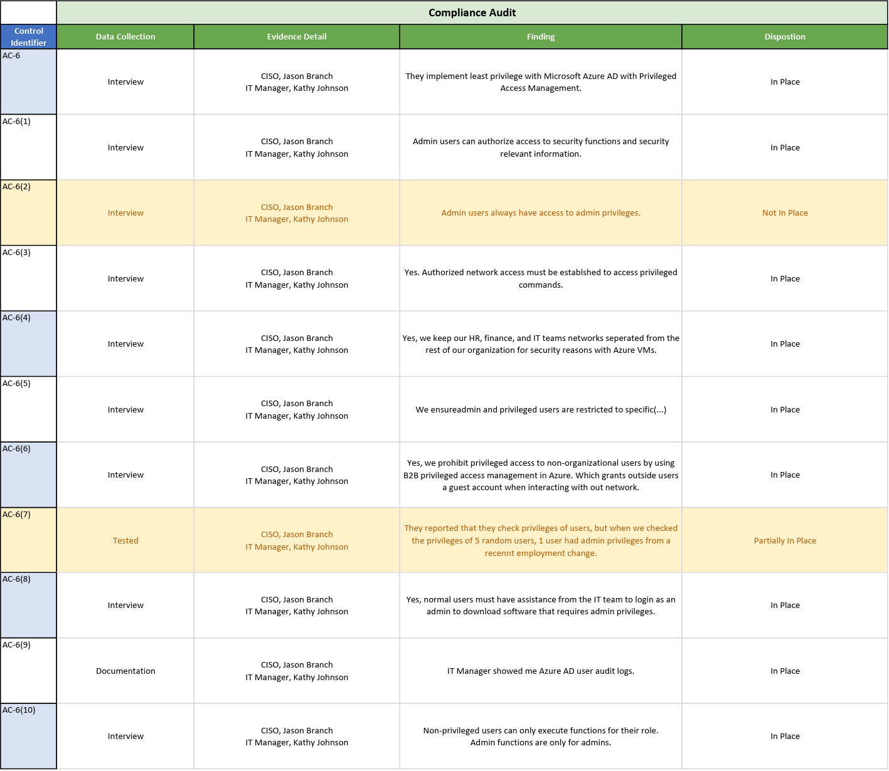
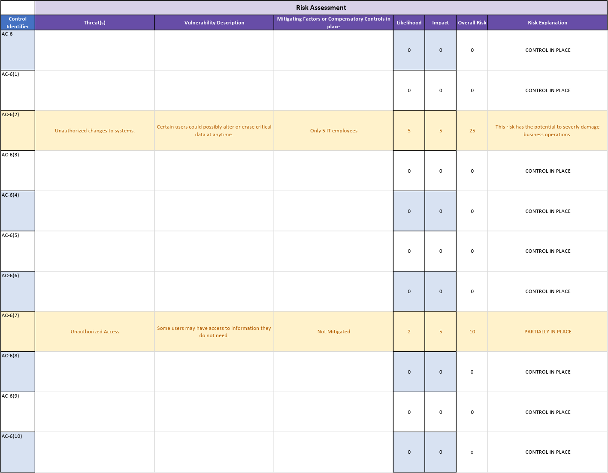

# NIST 800-53 Compliance Audit and Risk Assessment

## Compliance Audit - NIST AC-6 Least Privilege Controls
#### NIST AC-6 Least Privilege Control Catalog:

#### NIST AC-6 Compliance Audit Interview:
| Control Identifier | Question  | Response  |
| ------------- | ------------- | ------------- |
| AC-6 | How does your organization implement least privilege? Also how do you ensure that users only have access to the minimum level of data and functionality required to complete their assigned tasks? | We implement least privilege with our Microsoft Azure AD. We make sure that both normal and Admin users only have access to the required resources for their job. |
| AC-6(1) | How do you authorize access for special users to organizational defined security functions, & organization-defined security-relevant information? | Only Admin users (IT Team) can authorize access to security functions & security-relevant information.
| AC-6(2) | Do you make sure that Admin users with access to security functions use non-privileged accounts when accessing non-security functions?  | No, we do not. Our Admin users always have access to admin privileges. |
| AC-6(3) | Does authorized network access have to be established in your organization to access privileged commands? If so, do you document when that type of access takes place?  | Yes, authorized network access must be established to access privileged commands. Also, only a Super User... (IT Manager) can access privileged commands. All User log activity is logged in Azure.  |
| AC-6(4) | Do you separate your network domains between teams within the organization so that only specific users have access to that data? EX: VLANS  | Yes, we separate our HR, Finance, and IT teams network separate from the rest of our organization for security reasons with Azure VMs.  |
| AC-6(5) | How do you ensure that privileged accounts are restricted to specific personnel or roles? And how do you tell the difference between allowed local account privileges, and allowed admin account privileges?  | We ensure admin, and privileged users are restricted to specific roles with permission and role assignments in Azure AD for that specific user "RBAC (Role based access controls)". |
| AC-6(6) | Do you prohibit privileged access to non-organizational users? If so, how?  | Yes, we prohibit privileged access to non-organizational users by using B2B privileged access management in Azure. Which grants outside users a guest account when interacting with out network.  |
| AC-6(7) | Do you periodically review user privileges of users to see if they still need the privileges that they currently have? If access cannot be justified to the privilege, will you revoke access?  | Yes. And yes.... When checking 5 random users 1 had admin privileges from a recent position change.  |
| AC-6(8) | Do you make sure that normal users can not gain admin privileges for downloads to the devices?  | Yes, normal users must have assistance from the IT team to login as Admin to download software from admin privileges |
| AC-6(9) | Do you log and analyze the use of privileged functions in your organization?  | Yes. Using Azure Activity logs. (Evaluated)  |
| AC-6(10) | Do you prevent non-privileged users from executing privileged functions?  | Yes, non-privileged users can only execute functions for their role... Admin functions are only for admins. |

#### NIST AC-6 Compliance Audit Spreadsheet:

## Risk Assessment - NIST AC-6 Least Privilege Controls

#### Likelihood and Impact Values:

#### NIST AC-6 Risk Assessment Spreadsheet:

